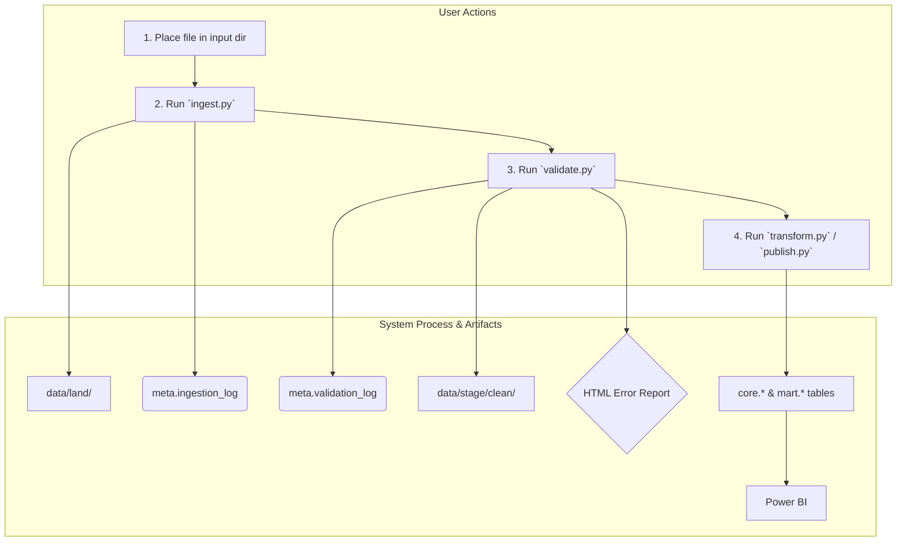

# Design Plan: Documentation Overhaul for User & Developer Onboarding

## 1. Executive Summary & Goals
This plan details the creation of a comprehensive documentation suite by evolving the technical specification (`autogen_readme.md`) into two distinct, purpose-driven documents: a user-centric `README.md` and a developer-focused `CONTRIBUTING.md`.

The key goals are:
-   **Targeted `README.md`:** Create an exceptionally clear, step-by-step `README.md` to guide a junior data engineer with limited Python experience through setup, configuration, and execution of the pipeline.
-   **Comprehensive `CONTRIBUTING.md`:** Establish a dedicated guide for developers, outlining coding standards, testing procedures, and the contribution workflow to ensure code quality and consistency.
-   **Separation of Concerns:** Clearly divide documentation for *using* the project (`README.md`) from documentation for *developing* the project (`CONTRIBUTING.md`), improving clarity for both audiences.

## 2. Current Situation Analysis
The project currently has a single document, `autogen_readme.md`, which is a highly detailed technical design specification.

-   **Strengths:** The document is technically rich, serving as an excellent blueprint for development by covering data layers, metadata, pipeline steps, data models, testing, and operational policies.
-   **Pain Points / Areas for Improvement:**
    -   **Audience Mismatch:** The document is too dense and technical for a junior user whose primary goal is to run the pipeline.
    -   **Lack of Separation:** It merges user-facing instructions with developer-facing specifications, making it difficult to navigate for either audience.
    -   **Missing Contribution Guidelines:** There are no formal guidelines for code style, branching, or pull requests, which is critical for collaborative development.

## 3. Proposed Solution / Refactoring Strategy
The solution is to create two new, canonical documents, sourcing their technical content from `autogen_readme.md` but restructuring it for their specific audiences.

1.  **`README.md`**: This will be the main entry point for the project, focusing entirely on the "user." In this context, the user is a junior data engineer who needs to run the pipeline. The tone will be instructional and supportive.
2.  **`CONTRIBUTING.md`**: This document will be aimed at developers (including the future, more experienced version of the junior DE) who want to modify, extend, or fix the codebase. It will be technical and prescriptive.

This approach ensures that each document serves a clear purpose without overwhelming its intended reader.

### 3.1. High-Level Design / Architectural Overview
The documentation architecture will be as follows:

```text
citizen_pipeline/
├── README.md           # For USERS: "How to set up and run this pipeline"
├── CONTRIBUTING.md     # For DEVELOPERS: "How to build, test, and contribute to this project"
├── data/
├── schemas/
├── src/
├── tests/
├── sql/
└── ... (other project files)
```

The `README.md` will contain a visual overview of the pipeline to quickly convey the process flow.



### 3.2. Detailed Action Plan / Phases

#### Phase 1: `README.md` - User Onboarding (Junior Data Engineer Focus)
-   **Objective(s):** Create a foolproof guide for a junior data engineer to get the pipeline running successfully.
-   **Priority:** High

-   **Task 1.1: Create Project Introduction & Features**
    -   **Rationale/Goal:** Immediately orient the user with a welcoming summary and a scannable list of what the project does.
    -   **Estimated Effort (Optional):** S
    -   **Deliverable/Criteria for Completion:** A `README.md` file with a project title, a 2-3 paragraph introduction, and a bulleted list of key features (e.g., "Automated Data Validation," "SCD-2 History," "Idempotent & Restartable").

-   **Task 1.2: Develop "Getting Started" Section**
    -   **Rationale/Goal:** Provide explicit, copy-paste-friendly setup instructions, explaining the 'why' behind each step for a junior engineer.
    -   **Estimated Effort (Optional):** M
    -   **Deliverable/Criteria for Completion:** A section with:
        1.  `Prerequisites`: Lists required software.
        2.  `Installation`: Provides commands for `git clone`, creating a Python virtual environment (e.g., `python -m venv venv`), and installing dependencies (`pip install -r requirements.txt`).
        3.  `Configuration`: Instructs the user to copy `.env.example` to `.env`, explaining that this file keeps secrets secure. Details which values to edit. Includes a command to run the DDL scripts to set up the database.

-   **Task 1.3: Write "Running the Pipeline" Section**
    -   **Rationale/Goal:** Clearly document the primary operational workflow with explanations of what each command achieves.
    -   **Estimated Effort (Optional):** M
    -   **Deliverable/Criteria for Completion:** A section detailing the end-to-end manual workflow. It must include:
        1.  The required **File Naming Convention**.
        2.  Numbered steps for each script (`ingest`, `validate`, `transform`, etc.) with full example CLI commands and a brief note on what the command does (e.g., "Step 1: Ingest the file. This copies it and creates a log to prevent duplicates.").
        3.  A description of the automated `run_pipeline.py` script.
        4.  Instructions for special procedures like `rollback`.

-   **Task 1.4: Add "Architecture Overview" Section**
    -   **Rationale/Goal:** Provide high-level context for the user to understand the system's design without overwhelming them.
    -   **Estimated Effort (Optional):** S
    -   **Deliverable/Criteria for Completion:** A section in the `README.md` containing the "Logical Data Layers" table and the Mermaid pipeline diagram.

#### Phase 2: `CONTRIBUTING.md` - Developer Onboarding
-   **Objective(s):** Create a single source of truth for developers to set up, build, test, and contribute code.
-   **Priority:** High

-   **Task 2.1: Create `CONTRIBUTING.md` Structure**
    -   **Rationale/Goal:** Establish the new document and outline its structure for clarity.
    -   **Estimated Effort (Optional):** S
    -   **Deliverable/Criteria for Completion:** A new `CONTRIBUTING.md` file is created with a title and a placeholder Table of Contents.

-   **Task 2.2: Document Development Environment Setup**
    -   **Rationale/Goal:** Provide detailed instructions for setting up a development-ready environment.
    -   **Estimated Effort (Optional):** S
    -   **Deliverable/Criteria for Completion:** A section detailing how to install dependencies from `requirements-dev.txt` (or similar) and configure any pre-commit hooks.

-   **Task 2.3: Define Coding Standards & Testing**
    -   **Rationale/Goal:** Ensure code quality and consistency across all contributions.
    -   **Estimated Effort (Optional):** M
    -   **Deliverable/Criteria for Completion:** Two sections:
        1.  `Coding Standards`: Documents the use of tools like `ruff` and `black`, and provides commands to run them.
        2.  `Testing`: Explains the different test layers (Unit, Integration, E2E) as per `autogen_readme.md` and provides specific commands to run each test suite (e.g., `pytest tests/unit`, `pytest --run-integration`).

-   **Task 2.4: Define Git Workflow & Pull Request Process**
    -   **Rationale/Goal:** Standardize the process for submitting and reviewing code changes.
    -   **Estimated Effort (Optional):** M
    -   **Deliverable/Criteria for Completion:** A section detailing:
        1.  Branching strategy (e.g., `feature/TICKET-123-new-feature`, `bugfix/TICKET-456-fix-validation`).
        2.  Pull Request (PR) requirements: Descriptive titles, linking to issues, and a checklist in the PR template (e.g., "- [ ] New code is tested", "- [ ] Documentation is updated").
        3.  Code review expectations and mention of required CI checks.

#### Phase 3: Finalization & Integration
-   **Objective(s):** Polish the documents and ensure they work together cohesively.
-   **Priority:** Medium

-   **Task 3.1: Add Cross-links**
    -   **Rationale/Goal:** Help users and developers navigate between the high-level and detailed documentation.
    -   **Estimated Effort (Optional):** S
    -   **Deliverable/Criteria for Completion:** The `README.md` includes a section like "Want to contribute? See our `CONTRIBUTING.md` guide." The `CONTRIBUTING.md` links back to the `README.md` for the project overview.

-   **Task 3.2: Final Review**
    -   **Rationale/Goal:** Ensure accuracy, clarity, and completeness across both documents.
    -   **Estimated Effort (Optional):** S
    -   **Deliverable/Criteria for Completion:** Both documents are proofread. A check is performed to confirm all relevant technical details from `autogen_readme.md` have been migrated to the appropriate new document.

## 4. Key Considerations & Risk Mitigation
### 4.1. Technical Risks & Challenges
-   **Risk:** Inconsistent or Conflicting Information. The two documents might contain contradictory instructions as the project evolves.
    -   **Mitigation:** The strict separation of concerns (user vs. developer) will be the guiding principle. The `README.md` will always defer to `CONTRIBUTING.md` for development topics.
-   **Risk:** Outdated Documentation. The new documents could become stale as the code changes.
    -   **Mitigation:** The PR template in `CONTRIBUTING.md` will include a mandatory checklist item: "[ ] I have updated the documentation (`README.md`, `CONTRIBUTING.md`) as needed."

### 4.2. Dependencies
-   **Internal:** The `CONTRIBUTING.md` content (e.g., linter commands) depends on the project's tooling being set up. The two documents should ideally be created in parallel or in the sequence outlined.

## 5. Success Metrics / Validation Criteria
-   **`README.md` Success:** A junior data engineer can clone the repository and successfully run a file through the entire pipeline using *only* the `README.md` for instructions.
-   **`CONTRIBUTING.md` Success:** A new developer can set up their local environment, run all tests, and successfully submit a pull request that adheres to the defined standards using *only* the `CONTRIBUTING.md`.
-   **Overall Success:** A post-implementation review confirms that all critical concepts from `autogen_readme.md` are present and correctly placed within the new documentation structure.

## 6. Assumptions Made
-   The user persona for the `README.md` is a **junior data engineer** who is comfortable with the command line but may have limited Python-specific knowledge.
-   The developer persona for the `CONTRIBUTING.md` is a software or data engineer familiar with standard development practices like Git, virtual environments, and testing.
-   The project will have `requirements.txt` and `requirements-dev.txt` (or similar) files to manage dependencies.

## 7. Open Questions / Areas for Further Investigation
-   Should a basic Pull Request template (`.github/PULL_REQUEST_TEMPLATE.md`) be created as part of this plan to enforce the guidelines defined in `CONTRIBUTING.md`? (Recommendation: Yes, this would be a high-value, low-effort addition).
-   Should a more detailed operational runbook be created as a separate document in a `docs/` folder for advanced topics like disaster recovery or complex manual interventions, keeping the `README.md` lean? (For now, the `README.md` is sufficient, but this can be considered for the future).